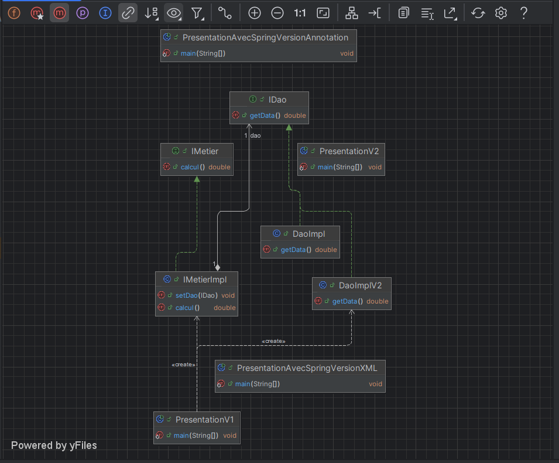

# TP1: Injection de Dépendances et Couplage Faible

Ce projet illustre les concepts d'Inversion de Contrôle (IoC) et d'Injection de Dépendances (ID) en Java, en explorant différentes approches manuelles et avec le Framework Spring.

## Partie 1 : Implémentation Manuelle et avec Spring

L'objectif de cette partie est de mettre en place une architecture simple avec une couche DAO (Data Access Object) et une couche Métier, en mettant l'accent sur le couplage faible et l'injection de dépendances.

### 1. Création de l'interface `IDao`

Une interface `IDao` est définie avec une méthode `getData()`.

```java
// Exemple de l'interface IDao
package ma.enset.dao;

public interface IDao {
    double getData();
}
```

### 2. Création d'une implémentation de `IDao`

Une classe `DaoImpl` implémente l'interface `IDao`.

```java
// Exemple de DaoImpl
package ma.enset.dao.impl;

import ma.enset.dao.IDao;

public class DaoImpl implements IDao {
    @Override
    public double getData() {
        // Simulation de la récupération de données
        System.out.println("Version base de données");
        double temp = Math.random() * 40;
        return temp;
    }
}
```

### 3. Création de l'interface `IMetier`

Une interface `IMetier` est définie avec une méthode `calcul()`.

```java
// Exemple de l'interface IMetier
package ma.enset.metier;

public interface IMetier {
    double calcul();
}
```

### 4. Création d'une implémentation de `IMetier` (Couplage Faible)

Une classe `MetierImpl` implémente `IMetier`. Elle utilise l'injection de dépendances pour recevoir une instance de `IDao`, assurant ainsi un couplage faible.

```java
// Exemple de MetierImpl
package ma.enset.metier.impl;

import ma.enset.dao.IDao;
import ma.enset.metier.IMetier;

public class MetierImpl implements IMetier {
    private IDao dao; // Couplage faible

    public MetierImpl(IDao dao) { // Injection via constructeur
        this.dao = dao;
    }

    @Override
    public double calcul() {
        double tmp = dao.getData();
        double res = tmp * 540 / Math.cos(tmp * Math.PI);
        return res;
    }

    // Setter pour injection (optionnel, pour d'autres types d'injection)
    public void setDao(IDao dao) {
        this.dao = dao;
    }
}
```

### 5. Injection des Dépendances

Différentes manières d'injecter la dépendance `IDao` dans `MetierImpl` sont explorées.

#### a. Par Instanciation Statique (Codage en dur)

L'instance de `DaoImpl` est créée directement dans le code client ou dans `MetierImpl`.

```java
// Dans une classe de présentation/test
// IDao dao = new DaoImpl();
// IMetier metier = new MetierImpl(dao);
// System.out.println("Résultat (statique) = " + metier.calcul());
```

#### b. Par Instanciation Dynamique (Fichier de configuration)

Le nom de la classe à instancier est lu depuis un fichier de configuration (par exemple, `config.txt`), puis instancié par réflexion.

**Contenu de `config.txt`:**

```
ma.enset.dao.impl.DaoImpl
ma.enset.metier.impl.MetierImpl
```

**Code d'instanciation dynamique:**

```java
// Scanner scanner = new Scanner(new File("config.txt"));
// String daoClassName = scanner.nextLine();
// Class<?> cDao = Class.forName(daoClassName);
// IDao dao = (IDao) cDao.getDeclaredConstructor().newInstance();

// String metierClassName = scanner.nextLine();
// Class<?> cMetier = Class.forName(metierClassName);
// IMetier metier = (IMetier) cMetier.getDeclaredConstructor(IDao.class).newInstance(dao);
// System.out.println("Résultat (dynamique) = " + metier.calcul());
```

#### c. En utilisant le Framework Spring

##### Version XML

La configuration des beans et des dépendances est effectuée dans un fichier XML (par exemple, `applicationContext.xml`).

**Contenu de `applicationContext.xml`:**

```xml
<?xml version="1.0" encoding="UTF-8"?>
<beans xmlns="http://www.springframework.org/schema/beans"
       xmlns:xsi="http://www.w3.org/2001/XMLSchema-instance"
       xsi:schemaLocation="http://www.springframework.org/schema/beans http://www.springframework.org/schema/beans/spring-beans.xsd">

    <bean id="dao" class="ma.enset.dao.impl.DaoImpl"/>

    <bean id="metier" class="ma.enset.metier.impl.MetierImpl">
        <constructor-arg ref="dao"/>
        <!-- Ou par setter :
        <property name="dao" ref="dao"/>
        -->
    </bean>
</beans>
```

**Code d'utilisation avec Spring XML:**

```java
// ApplicationContext context = new ClassPathXmlApplicationContext("applicationContext.xml");
// IMetier metier = context.getBean(IMetier.class);
// System.out.println("Résultat (Spring XML) = " + metier.calcul());
```

##### Version Annotations

Les beans sont déclarés et les dépendances injectées en utilisant des annotations Spring (`@Component`, `@Autowired`, etc.).

**Modifications des classes:**

`DaoImpl.java`:

```java
package ma.enset.dao.impl;

import ma.enset.dao.IDao;
import org.springframework.stereotype.Component;

@Component("dao") // ou @Repository
public class DaoImpl implements IDao {
    // ... (corps de la classe inchangé)
}
```

`MetierImpl.java`:

```java
package ma.enset.metier.impl;

import ma.enset.dao.IDao;
import ma.enset.metier.IMetier;
import org.springframework.beans.factory.annotation.Autowired;
import org.springframework.beans.factory.annotation.Qualifier;
import org.springframework.stereotype.Component;

@Component("metier") // ou @Service
public class MetierImpl implements IMetier {

    private IDao dao; // Couplage faible

    // Injection par constructeur
    @Autowired
    public MetierImpl(@Qualifier("dao") IDao dao) {
        this.dao = dao;
    }

    // Ou injection par setter (décommenter et commenter le constructeur @Autowired)
    /*
    @Autowired
    @Qualifier("dao")
    public void setDao(IDao dao) {
        this.dao = dao;
    }
    */

    @Override
    public double calcul() {
        double tmp = dao.getData();
        double res = tmp * 540 / Math.cos(tmp * Math.PI);
        return res;
    }
}
```

**Configuration pour le scan des composants (par exemple, `applicationContext.xml` ou une classe de configuration Java):**

Si utilisation d'un `applicationContext.xml` minimaliste :

```xml
<?xml version="1.0" encoding="UTF-8"?>
<beans xmlns="http://www.springframework.org/schema/beans"
       xmlns:xsi="http://www.w3.org/2001/XMLSchema-instance"
       xmlns:context="http://www.springframework.org/schema/context"
       xsi:schemaLocation="http://www.springframework.org/schema/beans
                           http://www.springframework.org/schema/beans/spring-beans.xsd
                           http://www.springframework.org/schema/context
                           http://www.springframework.org/schema/context/spring-context.xsd">

    <context:component-scan base-package="ma.enset"/>

</beans>
```

**Code d'utilisation avec Spring Annotations:**

```java
// ApplicationContext context = new ClassPathXmlApplicationContext("applicationContext.xml"); // (avec component-scan)
// Ou avec une classe de configuration Java:
// ApplicationContext context = new AnnotationConfigApplicationContext(AppConfig.class); // (si AppConfig est créée)
// IMetier metier = context.getBean(IMetier.class);
// System.out.println("Résultat (Spring Annotations) = " + metier.calcul());
```

## Diagramme de Conception



---

Ce README fournit un aperçu de la structure et des étapes du TP. Vous devrez créer les classes et fichiers de configuration correspondants dans votre projet Java.

---

© Réalisé par **EL MOUTAOUAKIL Abdellah** – [abdamota123@gmail.com](mailto:abdamota123@gmail.com)
